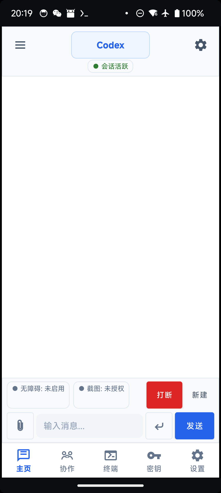
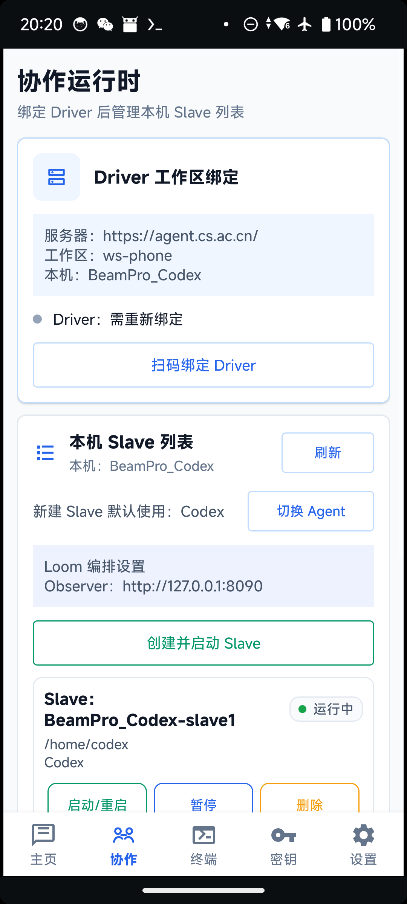
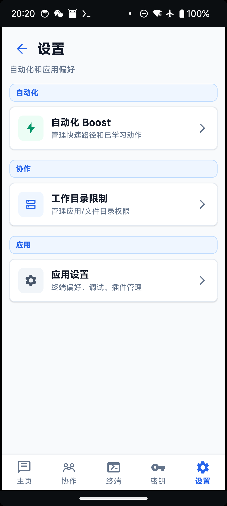
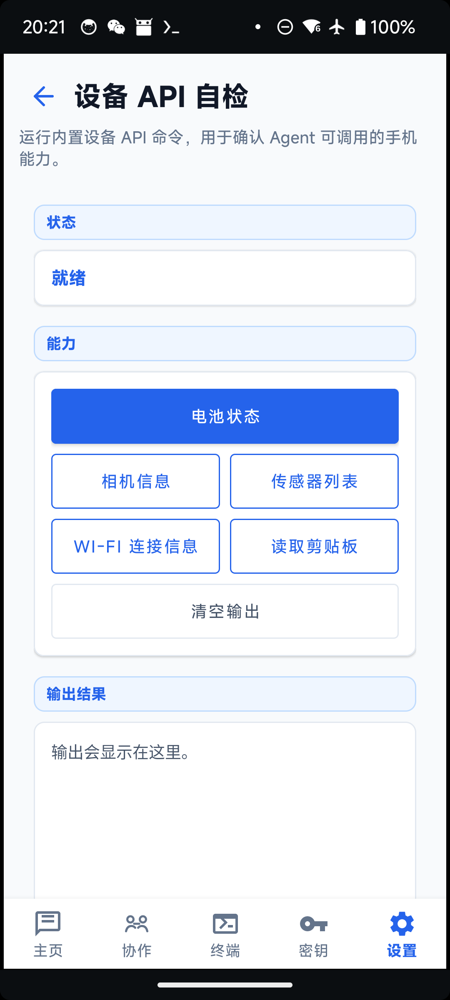

# PortalAgent

一个运行在 Android 手机上的本机 Agent 运行时。项目基于内置 Termux 运行层二次开发，在 PortalAgent 私有目录中部署 Ubuntu proot 环境，同时支持 Codex 和 Claude，并把手机能力通过 Android MCP 暴露给模型使用。

当前主路径以 Codex 为主，Claude 保留兼容。项目目标是让 Android 设备成为一个可交互、可协作、可被远端调度的 Agent 节点。

## 应用界面

| 主页对话 | 协作运行时 |
| --- | --- |
|  |  |

| 设置中心 | 设备 API 自检 |
| --- | --- |
|  |  |

## 功能说明

| 模块 | 作用 |
| --- | --- |
| 主页 | 本机 Codex / Claude 对话，支持流式输出、思考折叠、工具调用排序和对话历史 |
| 协作 | 管理 Driver 工作区绑定、本机运行时、Slave 列表、Loom 编排和 AgentServer 连接 |
| 终端 | 进入 Termux / Ubuntu 环境排查运行状态 |
| 密钥 | 分别管理 Codex 和 Claude 的 API Key、环境变量和配置文件 |
| 设置 | 自动化 Boost、工作目录限制、权限和调试入口 |

### 本机对话

- 顶部“切换 Agent”按钮用于在 Codex 和 Claude 之间切换。
- Codex / Claude 的历史、技能、记忆、上传文件和配置独立显示。
- 输出流会把思考过程、工具调用和最终回答分层展示。
- Markdown 中的加粗等基础格式会在气泡内渲染。
- 输出时页面不会强制跳到底部，便于从回答开头自然阅读。

### 手机能力

App 内置 Android MCP 工具，供 Codex / Claude 调用：

- 截图观察。
- 无障碍 UI 树读取。
- 点击、滑动、输入、按键。
- 打开应用和读取当前 Activity。
- 文件读取和目录管理。
- 设备状态、网络、电量、传感器等查询。
- ADB 候选操作能力。

部分 App 的无障碍节点可能不完整，项目会优先使用可验证的 UI 树操作，必要时补充 ADB 和截图识别方案。

### 协作运行时

协作页把 AgentServer 和 Loom 统一成一个运行时 Dashboard：

- Driver 工作区绑定：扫码登录并把本机 Driver 绑定到当前 AgentServer workspace。
- 本机运行时：展示当前设备的 Observer、Driver、Slave 状态。
- 本机 Slave 列表：创建、启动、暂停、删除本机 Slave，并按名称去重显示。
- Loom 编排：查询在线 agent / slave、检查能力、派发任务、调用 slave 工具。
- AgentServer 连接：作为不使用 Loom 编排时的传统 workspace 连接入口。

当前推荐路径是以 Driver 绑定作为主要协作入口。AgentServer 工作空间连接和 Loom Driver 绑定不是同一个凭据。

### 工作目录限制

工作目录限制用于控制 Agent 可以访问哪些目录和应用数据：

- Ubuntu 中当前 provider 用户目录默认可用。
- Android 基础公共目录可作为默认可选目录。
- 应用目录按应用列表勾选授权。
- 协作页只保留跳转入口，完整配置在设置页中完成。

这个功能用于减少 Agent 对无关文件和应用数据的访问面。

### 自动化 Boost

自动化 Boost 用于沉淀可复用的低风险手机操作路径：

- 第一次由 Agent 正常观察和操作。
- 成功后从 MCP 调用轨迹生成候选动作配方。
- 用户审核后加入白名单。
- 后续相似任务可直接执行配方，失败时清除 boosting 状态并回退给 Agent。

第一阶段只适合打开 App、进入固定页面、点击稳定按钮等低风险操作；发送、删除、支付、授权、密码和验证码等高风险动作不会自动 Boost。

### 设备 API 自检

设备 API 自检页用于确认 App 当前能否调用本机能力：

- 电池状态。
- 相机信息。
- 传感器列表。
- Wi-Fi 连接信息。
- 剪贴板读取。

从“应用设置 -> 设备 API 工具 -> 设备 API 自检”进入时，会保留底部导航栏，方便返回其他主页面。

## 安装要求

- Android 7.0+。
- arm64 设备。
- 建议预留 4GB 以上可用空间。
- 首次部署建议联网，便于包缺失或设备环境异常时走回退安装。
- 需要手动授权截图和无障碍权限，ADB 能力需要设备侧允许调试。

首次启动时请保持 App 在前台，等待终端安装脚本完成。安装完成后，Ubuntu、Codex/Claude 用户、Android MCP 配置、AgentServer addon 和 Loom addon 会被写入 App 私有目录。

## 仓库内置资产

当前仓库通过 Git LFS 跟踪大体积发布资产。首次克隆后请确认已安装 Git LFS，并执行 `git lfs pull` 拉取完整文件。

| 资产 | 路径 | 大小 | SHA256 |
| --- | --- | --- | --- |
| Ubuntu 快照 | `app/src/main/assets/ubuntu-snapshot/ubuntu-claude-aarch64-20260512.tar.xz` | 206,906,176 bytes | `E3B8D76D8CAFCC7207FC9E96FC41F6880BF65AF32D65BAEBC4A887586722E238` |
| Debug APK | `release/portal-agent_apt-android-7-debug_universal.apk` | 476,384,654 bytes | `F9FC1A0E0B86C27D7966785BBE1C3236C7AB7795EE7E7C0AFE8A6C53CB86DBC1` |

安装预构建 APK：

```powershell
adb install -r release\portal-agent_apt-android-7-debug_universal.apk
```

## 首次配置

### 1. 选择当前助手

主页顶部的“切换 Agent”按钮用于在 Codex 和 Claude 之间切换。切换只影响新的本机对话和后续协作配置生成，不会删除另一个 provider 的历史数据。

### 2. 配置密钥

进入底部“密钥”页：

- 顶部切换 Codex / Claude。
- 先配置 Agent 相关设置，再添加 API Key。
- Codex 写入 `OPENAI_API_KEY` 和 Codex 配置。
- Claude 写入 `ANTHROPIC_API_KEY`，可选写入 `ANTHROPIC_BASE_URL`。

两个 provider 的密钥、历史、技能和配置相互隔离。

### 3. 授权手机能力

主页和设置页会显示关键权限状态：

| 权限 | 用途 |
| --- | --- |
| 截图 | 让 Agent 观察屏幕内容 |
| 无障碍 | 读取 UI 树、点击、滑动、输入 |
| ADB | 在无障碍不稳定或不可用时提供候选操作通道 |

## 常见问题

### 进入 App 后对话区为空或历史突然恢复

通常是 provider 历史恢复、会话缓存和 UI 状态同步问题。先确认当前顶部显示的是 Codex 还是 Claude，再打开左侧抽屉查看对应 provider 的历史。

### Driver 已绑定，但查询不到 Slave

优先检查 Driver token 是否过期。App 会在复用 Driver 配置前调用 `/api/agent/whoami` 校验凭据；如果校验失败，需要重新扫码绑定 Driver。

### AgentServer 页面已连接，但 Driver 仍要求扫码

这是正常边界。AgentServer 工作空间连接和 Loom Driver 绑定不是同一个凭据。当前推荐路径是以 Driver 绑定作为主要协作入口。

### 截图或无障碍显示未授权

截图权限每次 App 重启后可能需要重新授权。无障碍权限需要进入系统设置打开本 App 的无障碍服务。部分系统会在应用更新后重置权限状态。

### Android Studio 编译出来像旧版本

先确认 Android Studio 打开的目录是：

```text
C:\ZRS_Works\Claude_code_test_app
```

然后执行 Gradle Sync 或 Clean/Rebuild。当前新版代码和 Loom/Codex 相关页面都在这个目录下。

## 实现方式

### Android 层

Android App 负责 UI、权限、MCP 工具和安装编排：

- `HomeFragment`：聊天主页，支持 Codex / Claude 切换。
- `ApiKeyFragment`：按 provider 隔离管理密钥和配置。
- `CollaborationFragment`：统一协作运行时控制台。
- `AgentServerFragment`：AgentServer 工作空间连接的高级页面。
- `LoomFragment`：Loom Driver / Slave / Observer 的高级配置页面。
- `WorkspaceAccessSettingsFragment`：工作目录限制和应用目录权限。
- `AppSettingsFragment`：把应用设置和设备 API 自检纳入底部导航体系。
- `McpHttpServer`：向 Ubuntu 内的 Agent 暴露 Android 工具。

### Ubuntu 层

App 内置一个共享 Ubuntu proot 环境，但 provider 状态拆到不同 Linux 用户下：

| Provider | Linux 用户 | Home | 主配置 | Key 环境变量 |
| --- | --- | --- | --- | --- |
| Codex | `codex` | `/home/codex` | `/home/codex/AGENTS.md`, `/home/codex/.codex/config.toml` | `OPENAI_API_KEY` |
| Claude | `claude` | `/home/claude` | `/home/claude/CLAUDE.md`, `/home/claude/.claude/settings.json` | `ANTHROPIC_API_KEY` |

Ubuntu 基础环境、Node.js、AgentServer 和 Loom 二进制共用同一个 rootfs，避免重复打包导致 APK 体积失控。

### 分包资产

当前 APK 内置这些离线资产：

| 资产 | 路径 | 作用 |
| --- | --- | --- |
| Ubuntu 快照 | `app/src/main/assets/ubuntu-snapshot/ubuntu-claude-aarch64-20260512.tar.xz` | Android 内 Ubuntu rootfs |
| AgentServer addon | `app/src/main/assets/agentserver-linux-arm64.tgz` | AgentServer CLI / 连接能力 |
| Loom addon | `app/src/main/assets/loom-linux-arm64.tgz` | `driver-agent`, `slave-agent`, `observer-server`, skills 和 prompt |

安装优先使用 APK 内置包；内置包缺失或损坏时，安装脚本可以按模块走联网回退下载。

新打包的 Ubuntu 快照已将旧包名路径重写为 `com.portalagent`，并保留运行时兼容修复逻辑，用于处理旧安装包或旧快照残留的绝对软链接。

## 构建

需要 JDK 17 和 Android SDK 36。

```powershell
cd C:\ZRS_Works\Claude_code_test_app
.\gradlew.bat :app:assembleDebug
```

Debug APK 输出位置：

```text
app\build\outputs\apk\debug\portal-agent_apt-android-7-debug_universal.apk
```

安装到已连接设备：

```powershell
adb install -r app\build\outputs\apk\debug\portal-agent_apt-android-7-debug_universal.apk
```

当前 APK 包含 Ubuntu 快照和 addon，体积约 400MB 以上。本仓库按当前发布策略使用 Git LFS 跟踪 `release/` 下的 APK；后续正式版本也可以同步上传到 GitHub Release，方便非开发用户下载。

## 常用验证命令

```powershell
.\gradlew.bat :app:testDebugUnitTest
.\gradlew.bat :app:assembleDebug
adb devices
adb install -r release\portal-agent_apt-android-7-debug_universal.apk
```

查看设备上安装版本：

```powershell
adb shell dumpsys package com.portalagent | findstr /i "versionName versionCode firstInstallTime lastUpdateTime"
```

## 排查路径

| 路径 | 内容 |
| --- | --- |
| `/data/data/com.portalagent/files/home/agentserver-agent.log` | AgentServer 运行日志 |
| `/data/data/com.portalagent/files/home/loom-driver-register.log` | Driver 注册日志 |
| `/data/data/com.portalagent/files/home/loom-slave.log` | Slave 运行日志 |
| `/data/data/com.portalagent/files/home/mcp-audit.log` | Android MCP 调用审计 |
| `/home/codex/AGENTS.md` | Codex 侧 Android 能力提示 |
| `/home/codex/.codex/config.toml` | Codex 配置 |
| `/home/claude/CLAUDE.md` | Claude 侧 Android 能力提示 |
| `/home/claude/.claude/settings.json` | Claude 配置 |

## 设计文档

主要设计记录在 `docs/superpowers/specs/` 下：

- `2026-06-04-codex-provider-support-design.md`
- `2026-06-03-loom-offline-addon-integration-design.md`
- `2026-06-10-automation-boost-design.md`
- `2026-06-16-agentserver-loom-connection-boundary-design.md`
- `2026-06-16-agentserver-loom-unified-collaboration-design.md`

旧的总体架构说明仍可参考：

- `docs/architecture/app架构.md`

## License

本项目基于 Termux 上游代码继续开发，继承对应开源协议。新增的 AgentServer / Loom 集成遵循各自上游项目协议。
